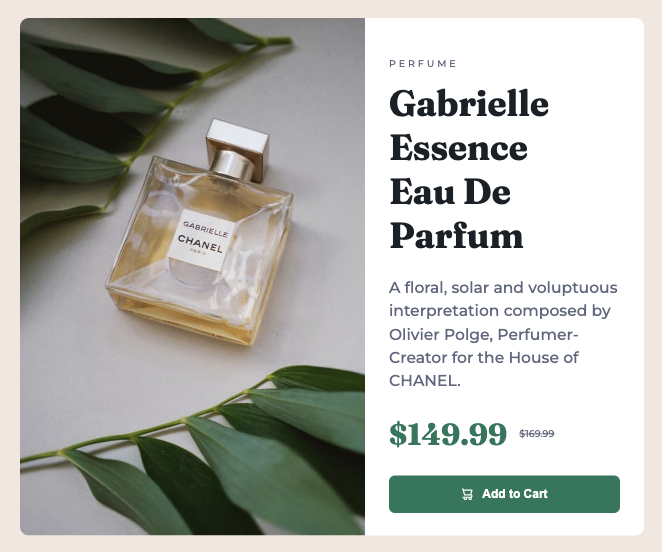

# Frontend Mentor - Product preview card component solution

This is a solution to the [Product preview card component challenge on Frontend Mentor](https://www.frontendmentor.io/challenges/product-preview-card-component-GO7UmttRfa). Frontend Mentor challenges help you improve your coding skills by building realistic projects.

## Table of contents

- [Overview](#overview)
  - [The challenge](#the-challenge)
  - [Screenshot](#screenshot)
  - [Links](#links)
- [My process](#my-process)
  - [Built with](#built-with)
  - [Code issues and considerations along the way](#code-issues-and-considerations-along-the-way)
  - [Code snippet](#code-snippet)
  - [Interesting article](#interesting-article)
- [Author](#author)

## Overview

### The challenge

Users should be able to:

- View the optimal layout depending on their device's screen size
- See hover and focus states for interactive elements

### Screenshot



### Links

- [Solution URL](https://github.com/codercreative/product-preview-card)

## My process

### Built with

- Semantic HTML5 markup
- CSS custom properties
- Mobile-first workflow

### Code issues and considerations along the way

- Overall, I still have to spend time practicing media queries to make as seamless a transition as possible.

- Considered using a helper class for margin-bottom to make the code DRY. However, with such a small project, I decided not to.

### Code snippet

Here is my favorite code sample for this project:

To make the button as wide as the container, this code did the trick:

```css
.btn {
  width: 100%;
}
```

Unexpected issue: When I entered the border radius for the top of the product card, i.e. the img tag - this caused the handle of the cart icon within the button to be cut off. I solved the issue via below code, however there must be a more elegant way to solve this...

```css
.cart {
  /* to make sure the handle of the cart is not cut off... */
  border-radius: 0 0 0 0;
}
```

### Interesting Article

I have been used hex codes for colors up until now. For this project, I decided on sticking with the hsl code format that Frontendmentor provided.

This article discusses the pros and cons of different color formats: [hsl vs hex vs rgb](https://blog.bitsrc.io/hex-vs-rgb-vs-hsl-what-is-the-best-method-to-set-css-color-property-f45d2debeee)

## Author

- Frontend Mentor - [@codercreative](https://www.frontendmentor.io/profile/codercreative)
